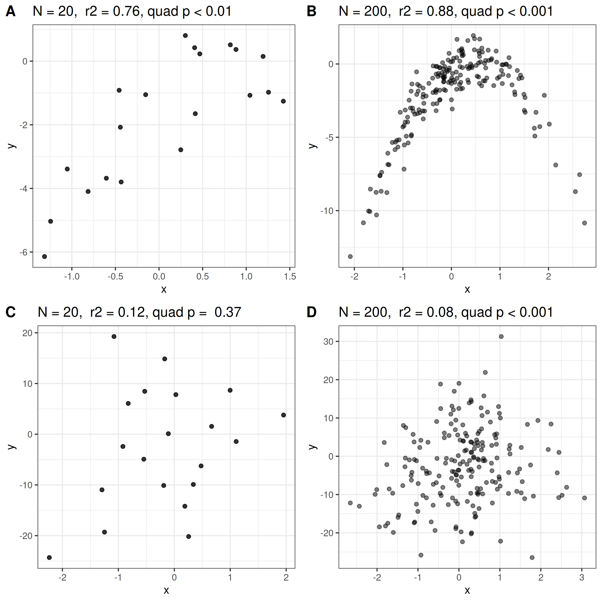

```{r setup, include=FALSE}
options(htmltools.dir.version = FALSE)
#htmltools::tagList(rmarkdown::html_dependency_font_awesome())
```

```{r global_options, include=FALSE}
knitr::opts_chunk$set(echo=FALSE, warning=FALSE, message=FALSE, dpi=200)
```


# Assuming that

- Your experimental design is solid.
- Your measurement is biologically meaningful and shows greater variance than the measurement
  errors.  
- You know a theory or logic behind the patterns you observed. 


Link to the slide.

- Code of this slide [https://github.com/mattocci27/pval](https://github.com/mattocci27/pval)

---

class: center, middle

# Problems of p-values in liner and non-linear models


```{r}
library(tidyverse)
library(mvtnorm)
theme_set(theme_bw())

set.seed(123)
N1 <- 20
N2 <- 200
rho <- 0.8
sig1 <- 1
sig2 <- 1

S <- matrix(c(sig1^2, rho*sig1*sig2, 
              rho*sig1*sig2, sig2^2), ncol = 2)

xy1 <- rmvnorm(N1, c(0, 0), S)
xy2 <- rmvnorm(N2, c(0, 0), S)
colnames(xy1) <-  colnames(xy2) <- c("x", "y")


# use quad

xy1[,2] <- rnorm(N1, -2 * (xy1[,1] - 0.5)^2, 1)
xy2[,2] <- rnorm(N2, -2 * (xy2[,1] - 0.5)^2, 1)


dat1 <- as_tibble(xy1)
dat2 <- as_tibble(xy2)
```

```{r}
rho_est <- cor.test(dat1$x, dat1$y)$estimate %>% round(2)
p_est <- cor.test(dat1$x, dat1$y)$p.value 

p_est_fun <- function(p_est) {
  if (p_est < 0.001) {
    p_est <- "quad p < 0.001"
  } else if (p_est < 0.01) {
    p_est <- "quad p < 0.01"
  } else if (p_est < 0.05) {
    p_est <- "quad p < 0.05"
  } else {
    p_est <- paste("quad p = ", p_est %>% round(2))
  }
  p_est
}

```


```{r, fig.width = 4, fig.height = 3.5}

fit1 <- lm(y ~ x + I(x^2), data = dat1) 
p1_1 <- summary(fit1)$coefficients[3, 3]
p2_1 <- summary(fit1)$coefficients[3, 4]
r2_1 <- summary(fit1)$r.squared %>% round(2)

p1 <- ggplot(dat1, aes(x = x, y = y)) +
  geom_point(alpha = 0.8) +
  ggtitle(paste0("N = ",  N1, ", ", " r2 = ", r2_1, ", ", p_est_fun(p2_1)))

```


```{r, fig.width = 4, fig.height = 3.5}
rho_est2 <- cor.test(dat2$x, dat2$y)$estimate %>% round(2)
p_est2 <- cor.test(dat2$x, dat2$y)$p.value

fit2 <- lm(y ~ x + I(x^2), data = dat2) 
p1_2 <- summary(fit2)$coefficients[3, 3]
p2_2 <- summary(fit2)$coefficients[3, 4]
r2_2 <- summary(fit2)$r.squared %>% round(2)

p2 <- ggplot(dat2, aes(x = x, y = y)) +
  geom_point(alpha = 0.5) +
  ggtitle(paste0("N = ",  N2, ", ", " r2 = ", r2_2, ", ", p_est_fun(p2_2)))

```


```{r}
rho <- 0.2

S <- matrix(c(sig1^2, rho*sig1*sig2, 
              rho*sig1*sig2, sig2^2), ncol = 2)

xy1 <- rmvnorm(N1, c(0, 0), S)
xy2 <- rmvnorm(N2, c(0, 0), S)
colnames(xy1) <-  colnames(xy2) <- c("x", "y")

xy1[,2] <- rnorm(N1, -2 * (xy1[,1] - 0.5)^2, 10)
xy2[,2] <- rnorm(N2, -2 * (xy2[,1] - 0.5)^2, 10)

dat3 <- as_tibble(xy1)
dat4 <- as_tibble(xy2)
```

```{r}
rho_est3 <- cor.test(dat3$x, dat3$y)$estimate %>% round(2)
p_est3 <- cor.test(dat3$x, dat3$y)$p.value

fit3 <- lm(y ~ x + I(x^2), data = dat3) 
p1_3 <- summary(fit3)$coefficients[3, 3]
p2_3 <- summary(fit3)$coefficients[3, 4]
r2_3 <- summary(fit3)$r.squared %>% round(2)

p3 <- ggplot(dat3, aes(x = x, y = y)) +
  geom_point(alpha = 0.8) +
  ggtitle(paste0("N = ",  N1, ", ", " r2 = ", r2_3, ", ", p_est_fun(p2_3)))
```

```{r}
rho_est4 <- cor.test(dat4$x, dat4$y)$estimate %>% round(2)
p_est4 <- cor.test(dat4$x, dat4$y)$p.value

fit4 <- lm(y ~ x + I(x^2), data = dat4) 
p1_4 <- summary(fit4)$coefficients[3, 3]
p2_4 <- summary(fit4)$coefficients[3, 4]
r2_4 <- summary(fit4)$r.squared %>% round(2)

p4 <- ggplot(dat4, aes(x = x, y = y)) +
  geom_point(alpha = 0.5) +
  ggtitle(paste0("N = ", N2, ", ", " r2 = ", r2_4, ", ", p_est_fun(p2_4)))
```
---

class: center, middle

# P-values sometimes get very small when there is no meaningfull pattern  

```{r, fig.width = 8, fig.height = 8, dpi=200}
p <- ggpubr::ggarrange(p1, p2, p3, p4, ncol = 2, nrow = 2, labels = LETTERS[1:4])
ggsave("images/summay_plt.png", p)
```



---

# D. Large sample size with no clear pattern

.pull-left-40[
```{r}
p4
```

]

.small[
.pull-right-60[
```{r}
summary(fit4)
```
]]

---

class: center, middle

# One solution: Cross-validation

---

## Idea

Estimating how accurately a model can predict a new data set.

.pull-left-50[
```{r}

dat4 <- dat4 %>%
  mutate(test = sample(c(rep("train", N2 * 0.9), rep("test", N2 * 0.1))))

train4 <- dat4 %>%
  filter(test == "train")

test4 <- dat4 %>%
  filter(test == "test")

fit4 <- lm(y ~ x + I(x^2), train4)
fit4_all <- lm(y ~ x + I(x^2), dat4)

ggplot(dat4) +
  geom_point(aes(x = x, y = y, col = test), alpha = 0.8, size = 4) +
  stat_smooth(data = train4,
              aes(x = x, y = y), method = "lm", se = FALSE, 
              formula = y ~ x + I(x^2), size = 1, col = "grey20") +
  stat_smooth(data = dat4,
              aes(x = x, y = y), method = "lm", se = FALSE, 
              formula = y ~ x + I(x^2), size = 1, col = "grey20", lty = 2) +
  ggtitle(paste0("N = ", N2, ", ", " r2 = ", r2_4, ", ", p_est_fun(p2_4)))


```
]


```{r}
library(cvTools)

# form https://github.com/mattocci27/TurnoverBCImain
cv_lm <- function(data, fit, K){
  res_cv <- NULL
  SS <- NULL
  PREDS <- NULL
  temp <- cvFolds(nrow(data), K = K, type = "random")
  temp <- data.frame(ID = temp$subsets, gr = temp$which) %>%
    arrange(ID)
  temp <- data.frame(data, temp)

  Call <- fit$call
  r2 <- NULL
  for (i in 1:K){
    Call$data <- filter(temp, gr != i)
    d_glm <- eval.parent(Call)

    test_dat <- temp %>% filter(gr == i)
    fitted <- predict(d_glm, test_dat, type = "response")
    fitted2 <- fitted
    yy <- test_dat$y

    SS[i] <- (yy - mean(yy, na.rm = T))^2 %>% mean
    PREDS[i] <- (yy - fitted2)^2 %>% mean(na.rm = T)
    r2[i] <- 1 - PREDS[i] / SS[i]
  }
  
  list(each_r2 = r2,
    CV_r2 =1 - mean(PREDS, na.rm = T) / mean(SS, na.rm = T)
  )
}

#cv_lm(dat2, fit2_all, K = 10)
```

.small[
.pull-right-50[

1. Use subset of the data (e.g., 90 %) to make a regression line (blue points, solid line)
2. Quantify how much this blue line can predict the data that were not used to
   make the model (red points). For example, we can calculate $r^2$.
3. Repeat 1-2 until you evaluate all the data. 
4. Finally, calculate the mean of the each $r^2$ (cross-validated $r^2$)
- In this example, each $r^2$ = `r cv_lm(dat4, fit4_all, K = 10)[[1]] %>% round(2)`
- $r_{CV}^2$ = `r cv_lm(dat4, fit4_all, K = 10)[[2]] %>% round(2)`
- When the model is very bad, $r^2$ can be negative.
]]

---

Small sample size is a problem too.

.pull-left-50[
```{r}

dat1 <- dat1 %>%
  mutate(test = sample(c(rep("train", N1 * 0.9), rep("test", N1 * 0.1))))

train1 <- dat1 %>%
  filter(test == "train")

test1 <- dat1 %>%
  filter(test == "test")

fit1 <- lm(y ~ x + I(x^2), train1)
fit1_all <- lm(y ~ x + I(x^2), dat1)
fit1_lm <- lm(y ~ x , dat1)

ggplot(dat1) +
  geom_point(aes(x = x, y = y, col = test), alpha = 0.8, size = 4) +
  stat_smooth(data = train1,
              aes(x = x, y = y), method = "lm", se = FALSE, 
              formula = y ~ x + I(x^2), size = 1, col = "grey20") +
  stat_smooth(data = dat1,
              aes(x = x, y = y), method = "lm", se = FALSE, 
              formula = y ~ x + I(x^2), size = 1, col = "grey20", lty = 2) +
  ggtitle(paste0("N = ", N2, ", ", " r2 = ", r2_1, ", ", p_est_fun(p2_1)))


```
]


.small[
.pull-right-50[
 - Based on 10-folds cross-validation, $r_{CV}^2$ = `r cv_lm(dat1, fit1_all, K = 10)[[2]] %>% round(2)`, which is much smaller than $r^2$ = `r r2_1`
- If we use a liner model, $r_{CV}^2$ = `r cv_lm(dat1, fit1_lm, K = 10)[[2]] %>% round(2)`
- A linear regression is more meaningfull or useful than a quadratic
  regression in this example.
- Reporting $r_{CV}^2$ (and a figure) is more fair than reporting *P*-value alone
  and a table.
]]

---

# Conclusion

- Reporting *P*-value alone is a problem.
- Presenting indices that assess the quality of predictors (e.g., $r 2$) is more kind for readers.
- Model validation is important, especially when the model is complicated 
    - Multiple regressions 
    - General additive models...
- Draw plots when it's possible
- Example for cross-validation:
   - Katabuchi, M., S. J. Wright, N. G. Swenson, K. J. Feeley, R. Condit, S. P. Hubbell, and S. J. Davies. 2017. Contrasting outcomes of species- and community-level analyses of the temporal consistency of functional composition. Ecology 98:2273–2280.[https://doi.org/10.1002/ecy.1952](https://doi.org/10.1002/ecy.1952)

