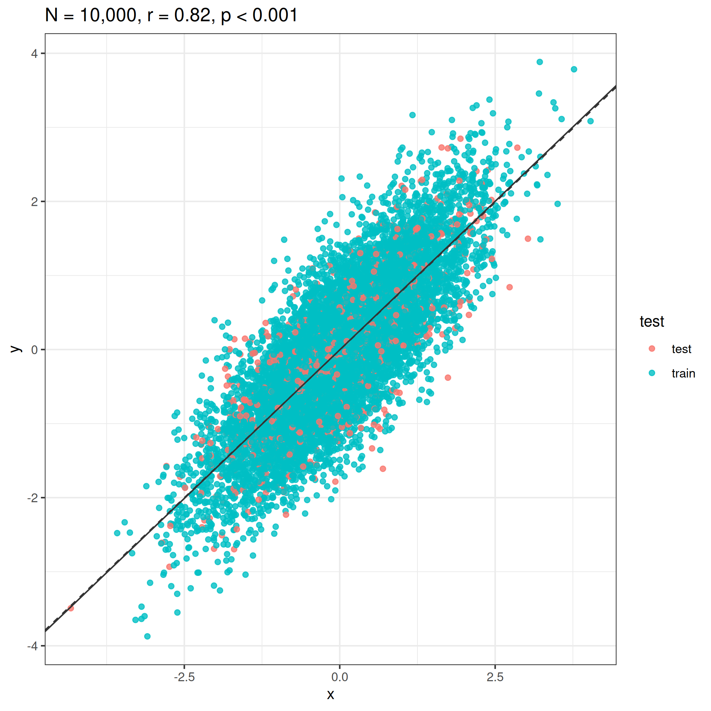

```{r setup, include=FALSE}
options(htmltools.dir.version = FALSE)
#htmltools::tagList(rmarkdown::html_dependency_font_awesome())
```

```{r global_options, include=FALSE}
knitr::opts_chunk$set(echo=FALSE, warning=FALSE, message=FALSE, dpi=200)
```

class: center, middle

# Problems of p-values in liner models


```{r}
library(tidyverse)
library(mvtnorm)
theme_set(theme_bw())

set.seed(123)
N1 <- 20
N2 <- 1000
rho <- 0.8
sig1 <- 1
sig2 <- 1

S <- matrix(c(sig1^2, rho*sig1*sig2, 
              rho*sig1*sig2, sig2^2), ncol = 2)

xy1 <- rmvnorm(N1, c(0, 0), S)
xy2 <- rmvnorm(N2, c(0, 0), S)
colnames(xy1) <-  colnames(xy2) <- c("x", "y")


# use quad

xy1[,2] <- rnorm(N1, -2 * (xy1[,1] - 0.5)^2, 1)
xy2[,2] <- rnorm(N2, -2 * (xy2[,1] - 0.5)^2, 1)


dat1 <- as_tibble(xy1)
dat2 <- as_tibble(xy2)
```

```{r}
rho_est <- cor.test(dat1$x, dat1$y)$estimate %>% round(2)
p_est <- cor.test(dat1$x, dat1$y)$p.value 

p_est_fun <- function(p_est) {
  if (p_est < 0.001) {
    p_est <- "p < 0.001"
  } else if (p_est < 0.01) {
    p_est <- "p < 0.01"
  } else if (p_est < 0.05) {
    p_est <- "p < 0.05"
  } else {
    p_est <- paste("p = ", p_est %>% round(2))
  }
  p_est
}

```


```{r, fig.width = 4, fig.height = 3.5}
p1 <- ggplot(dat1, aes(x = x, y = y)) +
  geom_point(alpha = 0.8) +
  ggtitle(paste0("N = ",  N1, ", ", " r = ", rho_est, ", ", p_est_fun(p_est)))

```


```{r, fig.width = 4, fig.height = 3.5}
rho_est2 <- cor.test(dat2$x, dat2$y)$estimate %>% round(2)
p_est2 <- cor.test(dat2$x, dat2$y)$p.value

p2 <- ggplot(dat2, aes(x = x, y = y)) +
  geom_point(alpha = 0.5) +
  ggtitle(paste0("N = ", N2, ", ", " r = ", rho_est2, ", ", p_est_fun(p_est2)))

```


```{r}
rho <- 0.2

S <- matrix(c(sig1^2, rho*sig1*sig2, 
              rho*sig1*sig2, sig2^2), ncol = 2)

xy1 <- rmvnorm(N1, c(0, 0), S)
xy2 <- rmvnorm(N2, c(0, 0), S)
colnames(xy1) <-  colnames(xy2) <- c("x", "y")

dat3 <- as_tibble(xy1)
dat4 <- as_tibble(xy2)
```

```{r}
rho_est3 <- cor.test(dat3$x, dat3$y)$estimate %>% round(2)
p_est3 <- cor.test(dat3$x, dat3$y)$p.value

p3 <- ggplot(dat3, aes(x = x, y = y)) +
  geom_point(alpha = 0.8) +
  ggtitle(paste0("N = ", N1,", ",  " r = ", rho_est3, ", ", p_est_fun(p_est3)))
```

```{r}
rho_est4 <- cor.test(dat4$x, dat4$y)$estimate %>% round(2)
p_est4 <- cor.test(dat4$x, dat4$y)$p.value

p4 <- ggplot(dat4, aes(x = x, y = y)) +
  geom_point(alpha = 0.5) +
  ggtitle(paste0("N = ", N2, ", ", " r = ", rho_est4, ", ", p_est_fun(p_est4)))
```
---

class: center, middle

# P-values sometimes get very small when there is no meaningfull pattern  

```{r, fig.width = 8, fig.height = 8, dpi=200}
p <- ggpubr::ggarrange(p1, p2, p3, p4, ncol = 2, nrow = 2, labels = LETTERS[1:4])
ggsave("images/summay_plt.png", p)
```


---

# D. *r* = 0.1 with large sample size

.pull-left-40[
```{r}
p4
```

]

.small[
.pull-right-60[
```{r}
lm(y ~ x, dat4) %>%
  summary
```
]]

---

class: center, middle

# One solutoin: Cross-validation

---

## Idea

Estimating how accurately a model can predict a new data set.

.pull-left-50[
```{r}

dat2 <- dat2 %>%
  mutate(test = sample(c(rep("train", N2 * 0.9), rep("test", N2 * 0.1))))

train2 <- dat2 %>%
  filter(test == "train")

test2 <- dat2 %>%
  filter(test == "test")

fit2 <- lm(y ~ x, train2)
fit2_all <- lm(y ~ x, dat2)

cv_plt2 <- ggplot(dat2, aes(x = x, y = y, col = test)) +
  geom_point(alpha = 0.8) +
  geom_abline(slope = fit2$coefficients[2], intercept = fit2$coefficients[1], 
              col = "grey20") +
  geom_abline(slope = fit2_all$coefficients[2], intercept = fit2_all$coefficients[1], 
              col = "grey20", lty = 2) +
  ggtitle(paste0("N = 1,000,", " r = ", rho_est, ", ", p_est_fun(p_est)))

cv_plt2

#ggsave("images/cv_plt2.png", cv_plt2)

#

```
]


```{r}
library(cvTools)

# form https://github.com/mattocci27/TurnoverBCImain
cv_lm <- function(data, fit, K){
  res_cv <- NULL
  SS <- NULL
  PREDS <- NULL
  temp <- cvFolds(nrow(data), K = 10, type = "random")
  temp <- data.frame(ID = temp$subsets, gr = temp$which) %>%
    arrange(ID)
  temp <- data.frame(data, temp)

  Call <- fit$call
  r2 <- NULL
  for (i in 1:K){
    Call$data <- filter(temp, gr != i)
    d_glm <- eval.parent(Call)

    test_dat <- temp %>% filter(gr == i)
    fitted <- predict(d_glm, test_dat, type = "response")
    fitted2 <- fitted
    yy <- test_dat$y

    SS[i] <- (yy - mean(yy, na.rm = T))^2 %>% mean
    PREDS[i] <- (yy - fitted2)^2 %>% mean(na.rm = T)
    r2[i] <- 1 - PREDS[i] / SS[i]
  }
  
  list(each_r2 = r2,
    CV_r2 =1 - mean(PREDS, na.rm = T) / mean(SS, na.rm = T)
  )
}

#cv_lm(dat2, fit2_all, K = 10)
```


.small[
.pull-right-50[

1. Use subset of the data (e.g., 10 %) to make a linear model (blue points, solid line)
2. Quantify how much this blue line can predict the data that were not used to
   make the model (red points). For example, we can calculate $r^2$.
3. Repeat 1-2 until you evaluate all the data. 
4. Finally, calculate the mean of the each $r^2$ (cross-validated $r^2$)
-  In this example, each $r^2$ = `r cv_lm(dat2, fit2_all, K = 10)[[1]] %>% round(2)`
-  $r_{CV}^2$ = `r cv_lm(dat2, fit2_all, K = 10)[[2]] %>% round(2)`
]]


---


.pull-left-50[
```{r, fig.width = 4, fig.height = 3.5}
dat4 <- dat4 %>%
  mutate(test = sample(c(rep("train", N2 * 0.9), rep("test", N2 * 0.1))))

train4 <- dat4 %>%
  filter(test == "train")

test4 <- dat4 %>%
  filter(test == "test")

fit4 <- lm(y ~ x, train4)
fit4_all <- lm(y ~ x, dat4)

ggplot(dat4, aes(x = x, y = y, col = test)) +
  geom_point(alpha = 0.8) +
  geom_abline(slope = fit4$coefficients[2], intercept = fit4$coefficients[1], 
              col = "grey20") +
  geom_abline(slope = fit4_all$coefficients[2], intercept = fit4_all$coefficients[1], 
              col = "grey20", lty = 2) +
  ggtitle(paste0("N = 1,000,", " r = ", rho_est4, ", ", p_est_fun(p_est4)))

```
]

.small[
.pull-right-50[
- In this example, the regression line from all the data (dahsed) and that from
  a test data (solid) is visually different.
- 
- each $r^2$ = `r cv_lm(dat4, fit4_all, K = 10)[[1]] %>% round(2)`
- $r_{CV}^2$ = `r cv_lm(dat4, fit4_all, K = 10)[[2]] %>% round(2)`
]]


moge

---


Estimating how accurately a model can predict a new data set.

.pull-left-50[
```{r}

dat3 <- dat3 %>%
  mutate(test = sample(c(rep("train", 18), rep("test", 2))))

train3 <- dat3 %>%
  filter(test == "train")

test3 <- dat3 %>%
  filter(test == "test")

fit3 <- lm(y ~ x, train3)
fit3_all <- lm(y ~ x, dat3)

cv_plt3 <- ggplot(dat3, aes(x = x, y = y, col = test)) +
  geom_point(alpha = 0.8) +
  geom_abline(slope = fit3$coefficients[2], intercept = fit3$coefficients[1], 
              col = "grey20") +
  geom_abline(slope = fit3_all$coefficients[2], intercept = fit3_all$coefficients[1], 
              col = "grey30", lty = 2) +
  ggtitle(paste0("N = 1,000,", " r = ", rho_est3, ", ", p_est_fun(p_est3)))

cv_plt3

#ggsave("images/cv_plt3.png", cv_plt3)

#

```
]

---


Estimating how accurately a model can predict a new data set.

.pull-left-50[
```{r}

dat1 <- dat1 %>%
  mutate(test = sample(c(rep("train", 18), rep("test", 2))))

train1 <- dat1 %>%
  filter(test == "train")

test1 <- dat1 %>%
  filter(test == "test")

fit1 <- lm(y ~ x, train1)
fit1_all <- lm(y ~ x, dat1)

cv_plt1 <- ggplot(dat1, aes(x = x, y = y, col = test)) +
  geom_point(alpha = 0.8) +
  geom_abline(slope = fit1$coefficients[2], intercept = fit1$coefficients[1], 
              col = "grey20") +
  geom_abline(slope = fit1_all$coefficients[2], intercept = fit1_all$coefficients[1], 
              col = "grey30", lty = 2) +
  ggtitle(paste0("N = 1,000,", " r = ", rho_est, ", ", p_est_fun(p_est)))

cv_plt1

#ggsave("images/cv_plt1.png", cv_plt1)

#

```
]
